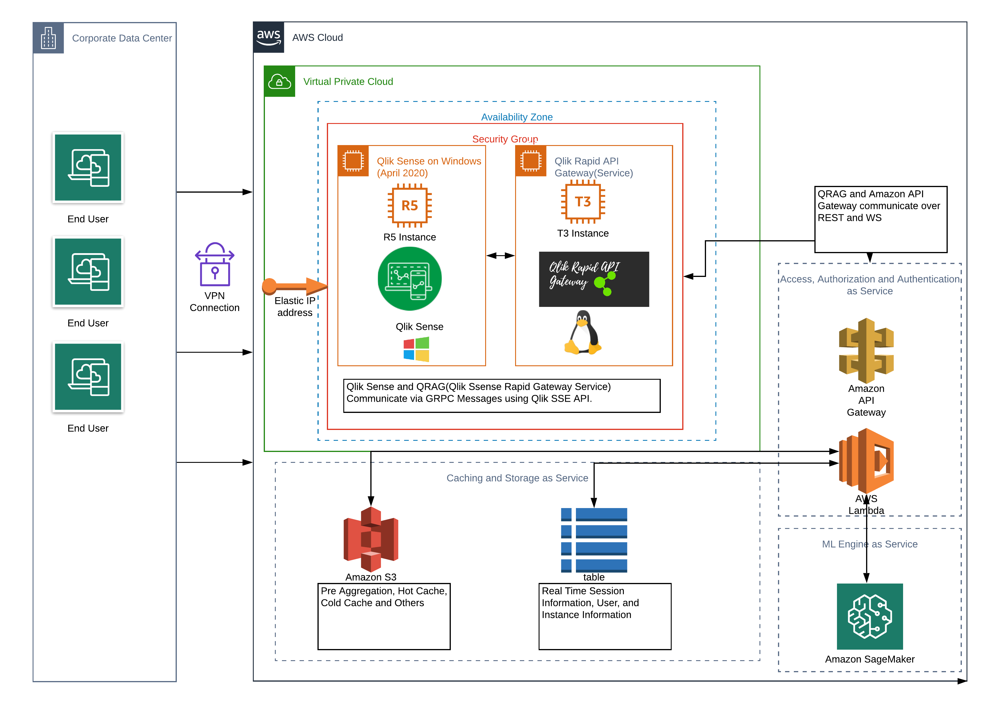

# Integrating Qlik with Google Cloud 

__Qlik Rapid API Gateway__ uses AWS GCP - Cloud ML Endpoint, AWS Lambda and AWS API Gateway for Integration. The overview of the solution looks like the following.

The Architecture uses modern micro services design patterns leveraging loosely coupled services.
Here is a quick explanation of component and role in the architecture.

- AWS GCP - Cloud ML - Platform Creating, Training and Publishing Endpoints for ML Models.
- AWS Lambda - Serverless functions to perform row by row data manipulation and facilitate connection to GCP - Cloud ML(GCP - Cloud ML preferred endpoin is written in BOTO3 Lambda can call BOTO3 functions and manipulate data easily).
- AWS DyanamoDB - Serverless Database Table to perform session management and storage layer for AWSLambda
- AWS API Gateway - API managmeent and Access layer for Sagmaker Endpoints.

The future view vision for architecture looks to create the following with a single script.

## Integration Use Cases

In our current release we are using Qlik as a Client of GCP - Cloud ML Endpoints. GCP - Cloud ML Endpoints are trained ML Models that can respond with predictions based on input data.

_Future Releases are scheduled where Qlik Scripts can send Data to GCP - Cloud ML for Additional Training using GCP - Cloud ML AutoML Function._

Follwing are Currently Implemented Capbility

1. Single Row Data Scoring in Real Time with GCP - Cloud ML.
2. Multi Row Data Scoring in Real Time with GCP - Cloud ML.
3. Interactive/RealTime Scoring as a Qlik Function with GCP - Cloud ML.
5. Support of REST andv WS version AWS Gateway.
6. Batch Size Support on WS API.

## Qlik GCP - Cloud ML Business Flow

## Architectural Diagram

## Installation and Setup

**GCP - Cloud ML Specific Setup** 
- Running Auto pilot
- Running GCP - Cloud ML Model 
- Creating GCP - Cloud ML Endpoint

**AWS Component Setup**
- Setting up Amazon API Gateway
- Setting AWS Lambda
- Setting Dynamodb

**QRAG/API Server Setup**
- Setting up EC2 instance
- Dowloanding Code
- Settting up Service to Start on Reboot

**Qlik Server Setup**

Setup Qlik Server to use Analytical Connection in the QMC

1. Log onto QMC
2. Create Analytics connections
   Detailed instructions can be found [here](https://help.qlik.com/en-US/sense-admin/June2020/Subsystems/DeployAdministerQSE/Content/Sense_DeployAdminister/QSEoW/Administer_QSEoW/Managing_QSEoW/create-analytic-connection.htm).
3. For Name use GCP - Cloud ML or somthing that can easily identify this module inside Qlik
4. For Port Use 50058 or 50051 - 50059

**_The Current integration has been tested on Qlik Sense Server 2020 Patch 2
qliksenseserver:13.72.5_**

#### 1. Defining [functions.json]

Basis of this implementation uses functions.json file from **Qlik SSE integration** (Please see reference [here](https://github.com/qlik-oss/server-side-extension)) you must use functions.json to expose integrated ML functions. The advantage of this implementation is natural feel of integration Qlik users.

Below is sample definition of function.json file located in sagemaker directiory/module.

##### FunctionDefinition -GCP - Cloud ML

The definition of a function, which informs the Qlik engine how to use it.

| Id | number | optional | A unique ID number for the function, set by the plugin, to be used in calls from the Qlik engine to the plugin. |
| Name | string | optional | The name of the function. |
| Type | Function Type | optional | We will define this as value 2(Tensor) which allows multiple rows in and multiple rows out. |
| QRAP_Type | Qlik Rapid API Function Type | optional | We will definte this as type of Function i.e. rest_single_ws |
| ReturnType | DataType | optional | The return type of the function. For GCP - Cloud ML we will define all return types as 0(string). (Qlik will be able manipulate the String to Int with in Qlik Engine. |
| Params | Parameters | repeated | The parameters the function takes. For GCP - Cloud ML preffered param is str1:0 where a single row or file has comma delimited string of all defined params. |

2.Defining [qrag.ini]  
 In sagemaker model of QRAG;**_qrag.ini_** is the file that defines your end points. The name of your functions defined in [functions.json has] to correspond with section defined in qrag.ini.

qrag.ini file location is current module/config/directory. i.e. ./sagemaker/config/qrag.ini

Below is sample definition of function.json file located in sagemaker directiory/module.  
Please note that __Name__ field and headers correspond.

 

QRAG will determinte the functions variable input such as url, username, token and cache(For Websocket we also need route defined)

3.Restarting Services
After functions.json and qrag.ini is set please restart Qlik Engine Services

## Testing

Up to 3000 row Bulk Scoring/Single Scoring Real Time
1 million row Batch Scoring via Qlik Script
12 users on App using Real Time Scoring Interface

## Trouble Shooting and Logs

Logs are located logs parent folder of QRAG and logger.cofing file determines verbosity of logs.

## References

10 Part Video on Setting QRAG with GCP - Cloud ML in Works